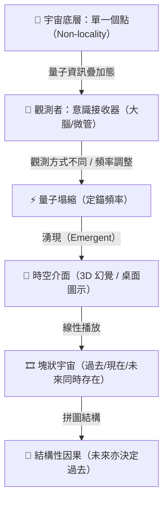

# 🌌 時間並非真實存在：意識與時空幻覺研究計畫
`The Time Is Not Real - Quantum, Spacetime, and Consciousness Research Project`

本研究計畫旨在探討前沿理論物理學（量子重力、全像原理、塊狀宇宙）與形上學（意識本質、唯心論、自由意志）的交會點。研究起源於 2026 年 7 月 2 日對 Gemini 公開分享對話（`https://share.gemini.google/7KkDQBoLc00V`）的深度解析，探討當我們抽離「時間」與「空間」這兩層維度後，宇宙底層的資訊本質與意識定錨機制。

---

## 🧭 研究核心架構

---

## 📚 核心理論與思想模型

> [!NOTE]
> ### 1. 萬物歸一與湧現時空 (Emergent Spacetime)
> *   **非定域性底層 (Non-locality)**：宇宙最基礎的維度沒有時間與空間，萬物本質上皆濃縮在「同一個點」上。
> *   **ER = EPR 猜想**：物理學家薩斯坎德與馬爾達西納提出，微觀的量子糾纏（EPR）本質上就是粒子間以微型蟲洞（ER）相連。粒子在底層資訊世界從未分開，因此能無視距離進行超光速瞬間感應。
> *   **全像原理**：時空並非基石，而是「湧現」的結果。大爆炸就像是將一個點上的量子數據，展開成了我們感知到的三維空間。

> [!IMPORTANT]
> ### 2. 桌面介面論與大腦接收器
> *   **桌面介面論 (Donald Hoffman)**：時空只是意識為了生存而演化出的「電腦桌面」。我們看見的物理實體（物質、肉身）僅是「虛擬圖示（Icons）」，背後的底層程式碼則是意識。
> *   **Orch-OR 理論 (Roger Penrose)**：意識不是大腦放電的副產品，而是編織在時空普朗克尺度的結構中。大腦（神經微管）是一台高精密的「量子訊號接收器/收音機」，死後接收器壞了，但意識訊號依然留存在底層點上。

> [!TIP]
> ### 3. 塊狀宇宙與結構因果 (Block Universe & causality)
> *   **永恆主義 (Eternalism)**：過去、現在、未來同時存在，宇宙是一捲沖洗好的電影底片。愛因斯坦名言：「過去、現在與未來的區別只是一種頑固的幻覺。」
> *   **同時性的崩潰**：相對論實驗（GPS 衛星修正、原子鐘飛行實驗、水塔重力實驗）證明全宇宙沒有統一的「現在」，引力與速度能任意拉扯時間。
> *   **非線性因果**：因果是結構上的拼圖關係，而非時間先後。未來與過去互為錨定、完美嵌合。

---

## 🎬 關鍵科學實驗與文獻對照

| 實驗/理論名稱 | 核心物理/腦科學現象 | 在本研究中的形上學詮釋 |
| :--- | :--- | :--- |
| **ER=EPR 猜想** | 量子糾纏本質為愛因斯坦-羅森橋（蟲洞） | 證實宇宙底層是非定域性的「單一個點」。 |
| **哈菲爾-基廷實驗** | 飛機上的原子鐘因速度與自轉方向產生時間偏差 | 證明時間的可塑性，消滅了「宇宙統一的現在」。 |
| **龐德-雷布卡實驗** | 塔尖的時間流逝速度比塔底快 | 證明引力會扭曲時空，宏觀時空只是橡皮膜般的幻覺。 |
| **利貝特實驗 (1983)** | 大腦在人意識到決定前 300-500ms 已出現準備電位 | 證實三維世界中的「自我意識」只是後台計算完成後的「發言人」。 |
| **停表錯覺 (Chronostasis)** | 轉頭看鐘時秒針彷彿停滯，大腦自動修補視覺空白 | 證明「現在」的線性流動只是大腦事後剪輯出的特技。 |

---

## 🎯 未來接續研究課題

### 📂 課題一：自由意志在塊狀宇宙中的定錨機制
*   **研究方向**：如果未來早已刻在底片上，人類的「自由意志」是如何扮演導航員的？
*   **核心假說**：自由意志是收音機的「旋鈕」，它不創造新底片，但透過改變觀測的頻率與心念，決定將體驗塌縮到無數個預設未來（疊加態）中的哪一個版本。

### 📂 課題二：人際緣分與非定域性量子糾纏的關聯
*   **研究方向**：人與人之間的「集體潛意識」與「宿命緣分」，在物理上是否為底層單一個點上尚未展開的量子資訊糾纏？
*   **研究方法**：結合量子貝氏主義（QBism）的「主觀機率波函數」進行模型化推導。

### 📂 課題三：永恆主義下的心靈虛無跨越
*   **研究方向**：如何利用「過去從未消失、宇宙不曾遺忘任何切片」的塊狀宇宙觀，撫平人類對時間流逝與死亡的恐懼？
*   **實踐價值**：當下做的每一個溫柔的抉擇與善意，都如同刻刀一樣，在宇宙這塊四維麵包上留下了永遠無法抹去的永恆刻印。

---

> [!CAUTION]
> ### ⚠️ 研究邊界與警示
> 本計畫所探討之形上學假說（唯心論、意識旋鈕）雖與前沿理論物理（如 QBism、Orch-OR、桌面介面論）有邏輯上的對齊，但多數仍處於科學界的前沿爭論與非主流學派。後續研究應嚴格區分「已證實的物理效應（如相對論時間膨脹）」與「推論性哲學假說」，避免滑入非科學的神秘主義。

---

*研究建檔日期：2026年7月2日*  
*研究單位：The Time Is Not Real 研究小組*
