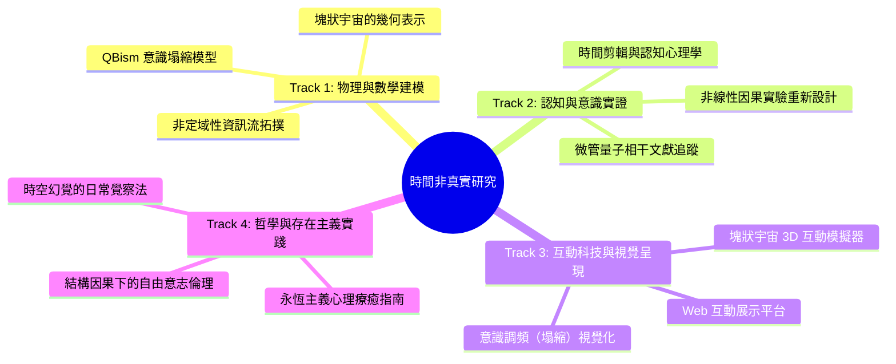

# 🌌 時間並非真實存在：研究計畫分向發展藍圖
`The Time Is Not Real - Multi-Track Development Roadmap`

本文件基於 2026 年 7 月 2 日確立之研究核心架構，將「時空湧現與意識定錨」之宏大命題，細分拆解為四個具體、互補且可獨立演進的發展方向（Tracks）。

---

## 🧭 四大發展方向總覽

---

## 🔬 Track 1：物理與數學建模組 (Scientific Modeling & Theory Track)
**核心目標**：為「宇宙底層非定域性」與「意識作為觀測塌縮旋鈕」提供嚴謹的理論物理對齊與數學形式化描述。

### 📅 發展課題
1. **QBism（量子貝氏主義）與意識抉擇的數學結合**
   *   將主觀波函數視為觀測者的「信念機率」。
   *   建構一個狀態轉移模型，描述意識的「心念（觀測角度改變）」如何作為邊界條件，影響特定歷史路徑的塌縮機率。
2. **ER = EPR 拓撲簡化模型**
   *   探討在沒有度規空間（Metric-free）的圖論底層中，糾纏熵如何定義「距離」，進而湧現出三維空間。
3. **塊狀宇宙的幾何學表示**
   *   利用閔考斯基時空的幾何結構，推導「未來亦決定過去」的非線性雙向因果關係（Retrocausality）。

### 📦 預期產出
*   `theory_models/qbism_decision_model.py`：主觀機率波塌縮的 Python 數值模擬程式碼。
*   《非定域性湧現時空與意識定錨之數學架構》白皮書草案。

---

## 🧠 Track 2：認知與意識實證組 (Cognitive Science & Consciousness Track)
**核心目標**：檢驗生物大腦作為「量子信號接收器」的生理與心理學證據，並針對現有實驗進行形上學的重新詮釋。

### 📅 發展課題
1. **Orch-OR（微管量子相干）之現代文獻追蹤與評估**
   *   追蹤謝爾頓（Stuart Hameroff）與羅傑·潘洛斯（Roger Penrose）理論的最新實驗進展（如微管在紫外光或微波頻段的量子相干性實驗）。
2. **利貝特實驗（Libet Experiment）的非線性因果詮釋**
   *   分析「準備電位（Ready Potential）」在塊狀宇宙中的意義：準備電位不是自由意志被否定的證據，而是未來決定路徑在三維投影中的「回溯漣漪」。
3. **時間剪輯與大腦「後製」機制**
   *   研究「停表錯覺（Chronostasis）」與「閃光滯後效應（Flash-lag effect）」等大腦修補機制，證明線性時間是意識事後重組的產物。

### 📦 預期產出
*   《大腦接收器與時間剪輯：認知科學文獻與假說彙編》。
*   「非線性時間感知」的認知心理學實驗設計提案（擬用於測試人類對未來事件的微弱潛意識感應）。

---

## 🎨 Track 3：互動科技與視覺呈現組 (Interactive Tech & Visualization Track)
**核心目標**：利用現代 Web 科技，將極度抽象的物理與形上學概念視覺化，建立能激發大眾直覺理解的互動媒介。

### 📅 發展課題
1. **塊狀宇宙（Block Universe）互動膠卷模擬器**
   *   開發一個互動 3D 介面，使用者可以像拖曳電影底片一樣，在「過去、現在、未來」之間穿梭，並從四維視角觀察「三維切片」的湧現。
2. **「意識調頻」多維度投影展示**
   *   設計一個互動控制台，模擬大腦微管（收音機）調整接收頻率，看不同的頻率如何將同一個底層非定域資訊源，塌縮成完全不同的三維場景（平行世界）。
3. **ER = EPR 糾纏蟲洞視覺化**
   *   以視覺動畫呈現兩個空間上相距光年的粒子，在底層資訊點上實為一體動態過程。

### 📦 預期產出
*   基於 Vite + HTML5 Canvas / Three.js 的**「時空幻覺互動展示平台」**網頁應用程式。

---

## 🕯️ Track 4：哲學與存在主義實踐組 (Philosophy & Existential Practice Track)
**核心目標**：將冰冷的物理理論轉化為心靈撫平、死亡焦慮跨越與自由意志責任的倫理實踐指南。

### 📅 發展課題
1. **永恆主義心理療癒（Therapeutic Eternalism）**
   *   如何利用「過去不曾消失」的塊狀宇宙觀，輔平對於逝去親人、遺憾往事的悲傷。
   *   「你所度過的每一個溫暖片刻，都永遠固定在宇宙的四維麵包中，不曾褪色。」
2. **非線性因果下的自由意志倫理**
   *   如果未來已定，責任是否依然存在？
   *   重新定義自由意志：自由意志不是「無中生有地創造未來」，而是「選擇去認同並經歷哪一種永恆的拼圖」。
3. **時空幻覺的日常覺察實踐（Mindfulness of Spacetime Illusion）**
   *   開發一套冥想或心智訓練方法，引導個人在日常生活中體驗「當下即是一切，距離只是介面」的非定域覺知。

### 📦 預期產出
*   《永恆主義心靈指南：如何在沒有時間的宇宙中生活與去愛》。

---

## 📈 短期執行建議 (Next Steps)

> [!TIP]
> 建議初期以 **Track 3 (互動視覺化)** 與 **Track 1 (物理數學建模)** 作為雙引擎並進：
> *   透過 **Track 3** 建立直觀的互動網頁，能幫助我們在討論 **Track 1** 的抽象數學時有具體的視覺依據。
> *   同時利用 **Track 2** 與 **Track 4** 作為理論底蘊與哲學應用的延伸。

*文件建立日期：2026年7月2日*  
*研究單位：The Time Is Not Real 研究小組*
